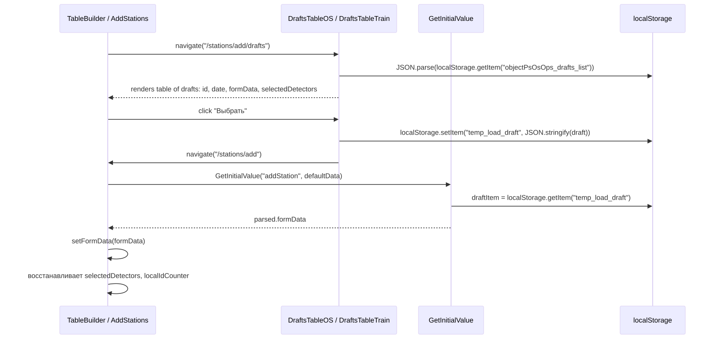
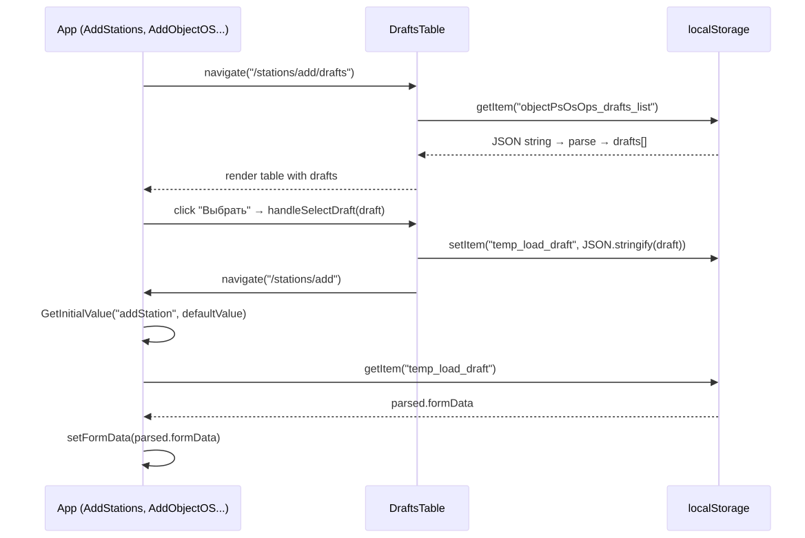

# React + TypeScript + Vite

## Диаграммы сгенерированы нейронкой (квен локальной) на основе проекта так что с осторожностью к точности

## Навигация и првоерка прав

### Route

### Auth

## Диаграмма взаимодействия компонентов на страницах с отображением таблиц (TableBuilder)

### Общее взаимодействие с потомками у TableBuilder

## Страницы создания

### AddObjectOS

### AddTrain

## Страница черновиков

### Drafts GetInitValue

### Drafts localstorage

## Страница графиков

### ExcelViewer-axios

## Страница отчетов

## SearchableInput

### Взаимодействие с аксиосом

### Сам компонент

